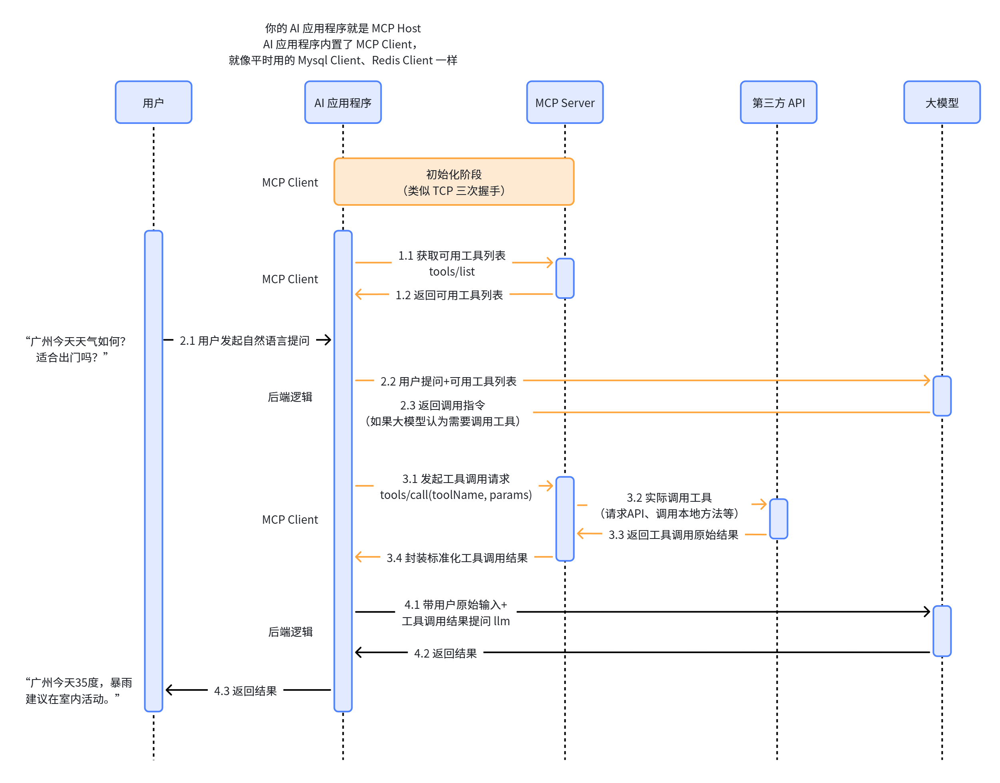

# MCP 搭建笔记（weather-assistant 实战）

记录从认识 MCP 到把一个 weather Server 接入 Claude Desktop / Cursor 的完整过程，包含核心概念梳理、关键代码、客户端配置、踩坑记录、升级思路。

---

## 1. 整理思路

1. 先建立 MCP 的标准分层认知。
2. 再理解协议调用链和核心模块边界。
3. 最后映射到当前 weather 项目的具体代码、配置、运行与排错。

---

## 2. 我希望搞清楚的事

整理完这份笔记，要能做到：

- 准确区分 Host / Client / Server 的职责边界。
- 理解 Resources / Tools / Prompts 的定位和适用场景。
- 独立搭建一个可运行的 MCP Server，并接入 Claude Desktop / Cursor。
- 使用 `mcp-cli` 与 Inspector 完成联调。
- 处理常见问题（端口冲突、路径转义、401、代理异常、stdio 误用等）。
- 理解 HTTP 化与授权的升级方向。

---

## 3. MCP 三层架构（标准模型）

### 3.1 Host（宿主应用）

Host 是用户使用的 AI 应用外壳（如 Claude Desktop、Cursor Agent）。它负责：

- 用户交互入口
- 模型调用编排
- 工具调用审批与展示

### 3.2 Client（协议客户端）

Client 是 Host 内部"会说 MCP 协议"的组件。它负责：

- 与 Server 建连
- 初始化与协议协商
- 能力发现（list tools / resources / prompts）
- 请求转发与结果回收

### 3.3 Server（能力提供端）

Server 负责把真实外部系统能力标准化暴露给 Client。它负责：

- 声明能力（tools / resources / prompts）
- 执行后端动作（API / DB / 文件系统）
- 返回结构化结果

一句话记忆：

- Host 管交互
- Client 管协议
- Server 管能力

---

## 4. MCP 能力模型与关键词

### 4.1 Resources

- 定位：给模型"看"的只读上下文
- 常见内容：文档、schema、配置、报表、说明数据
- 关键特征：读多写少，无副作用

### 4.2 Tools

- 定位：给模型"做"的可执行动作
- 常见动作：查询、创建、更新、触发外部 API
- 关键特征：有参数、可能有副作用、需要权限边界

### 4.3 Prompts

- 定位：可复用任务模板
- 作用：规范任务输入，提升模型工具调用稳定性
- 关键特征：模板本身不执行外部动作，常用于引导调用 Tool

### 4.4 扩展能力（生产常见）

- Transport：STDIO / SSE / Streamable HTTP
- Authorization：谁能调、代表谁调、能调什么
- Protocol Negotiation：协议版本对齐
- Capability Discovery：能力菜单发现
- Notifications / Sampling：高级交互机制

---

## 5. MCP 标准调用流程（时序）



流程摘要：

1. Client 初始化连接 Server，并获取可用工具列表。
2. 用户提问后，Host 将"问题 + 可用工具信息"交给模型。
3. 模型决定是否调用工具；若调用，返回工具调用指令。
4. Client 调用 MCP Server 对应 Tool。
5. Server 调用第三方 API / 本地逻辑并返回结构化结果。
6. Host 将工具结果回填模型，生成最终自然语言答复。

---

## 6. 当前项目的映射关系

对应路径：`mcp-server/weather-mcp-server.py`

- Host：Claude Desktop / Cursor
- Client：各自内置 MCP Client
- Server：`weather-assistant`
- Tool：`get_weather_advice(prompt)`
- Prompt：`weather_trip_brief(city, day, activity)`
- 第三方 API：OpenWeather Assistant API

Tool 执行链：

`Client → get_weather_advice → call_weather_api → OpenWeather → structured result → Client`

---

## 7. mcp-cli 安装与使用（Windows + uv）

### 7.1 安装

```powershell
cd E:\mcp_project
uv venv .venv
uv pip install --python .venv\Scripts\python.exe "mcp[cli]"
```

### 7.2 验证

```powershell
E:\mcp_project\.venv\Scripts\mcp.exe --help
E:\mcp_project\.venv\Scripts\mcp.exe version
```

### 7.3 调试运行（Inspector）

Inspector 是 MCP 的核心调试工具——它扮演一个临时 Client，让你在浏览器里手动调用 Tool 验证 Server 行为。

```powershell
E:\mcp_project\.venv\Scripts\mcp.exe dev E:\mcp_project\mcp-server\weather-mcp-server.py
```

启动后控制台会输出 Inspector URL（默认 `http://127.0.0.1:6274`）。打开后：

- 左侧 Tools 面板能看到 `get_weather_advice` 自动出现
- 点 Tool → 右侧填参数 → 点 Run → 查看结构化返回
- Prompts 面板同理

### 7.4 标准运行（供客户端 stdio 托管）

```powershell
E:\mcp_project\.venv\Scripts\mcp.exe run E:\mcp_project\mcp-server\weather-mcp-server.py
```

> 注意：`mcp run` 是给 Client 用 stdio 协议对话的，**不是**给人手工输入的。手工跑会立即报 `Invalid JSON: EOF while parsing`。

### 7.5 用 uv run 包装（推荐）

```powershell
cd E:\mcp_project
uv run --active mcp dev mcp-server\weather-mcp-server.py
uv run --active mcp run mcp-server\weather-mcp-server.py
```

---

## 8. 客户端接入配置

### 8.1 Claude Desktop

文件：`C:\Users\<用户名>\AppData\Roaming\Claude\claude_desktop_config.json`

```json
{
  "mcpServers": {
    "weather-assistant": {
      "command": "uv",
      "args": [
        "run",
        "--project",
        "E:\\mcp_project",
        "--python",
        "E:\\mcp_project\\.venv\\Scripts\\python.exe",
        "mcp",
        "run",
        "E:\\mcp_project\\mcp-server\\weather-mcp-server.py"
      ],
      "env": {
        "OPENWEATHER_API_KEY": "<YOUR_OPENWEATHER_KEY>"
      }
    }
  }
}
```

### 8.2 Cursor

文件：`C:\Users\<用户名>\.cursor\mcp.json`

```json
{
  "mcpServers": {
    "weather-assistant": {
      "command": "uv",
      "args": [
        "run",
        "--project",
        "E:\\mcp_project",
        "--python",
        "E:\\mcp_project\\.venv\\Scripts\\python.exe",
        "mcp",
        "run",
        "E:\\mcp_project\\mcp-server\\weather-mcp-server.py"
      ],
      "env": {
        "OPENWEATHER_API_KEY": "<YOUR_OPENWEATHER_KEY>"
      }
    }
  }
}
```

### 8.3 接入要点

- JSON 路径中所有 `\` 必须写成 `\\`，单反斜杠会被当转义符吞掉。
- `OPENWEATHER_API_KEY` 通过客户端 `env` 字段注入，不写死代码。
- 改完配置必须**完全退出**客户端进程后重启（不是关窗口）。

---

## 9. 当前 Server 关键代码

文件：`mcp-server/weather-mcp-server.py`

### 9.1 实例化 Server

```python
from mcp.server.fastmcp import FastMCP

mcp = FastMCP("weather-assistant")
```

`FastMCP` 是官方 Python SDK 的高层封装，参数是 Server 对外名字（这个名字会出现在客户端配置的 `mcpServers` 键里）。

### 9.2 真正干活的函数（不带装饰器）

```python
def call_weather_api(prompt: str) -> Dict[str, Any]:
    load_dotenv()
    api_key = os.getenv("OPENWEATHER_API_KEY")
    if not api_key:
        raise ValueError("缺少 OPENWEATHER_API_KEY，请在 .env 中配置")

    headers = {"Content-Type": "application/json", "X-Api-Key": api_key}
    response = requests.post(
        API_URL, headers=headers, json={"prompt": prompt}, timeout=60,
    )
    response.raise_for_status()
    return response.json()
```

这是个纯函数——不知道 MCP 的存在。这种分层抽离让逻辑可以独立单测，也能被非 MCP 场景复用。

### 9.3 暴露 Tool

```python
@mcp.tool()
def get_weather_advice(prompt: str) -> Dict[str, Any]:
    """通过自然语言提问调用 OpenWeather AI 天气助手。"""
    try:
        result = call_weather_api(prompt)
        return {
            "ok": True,
            "answer": result.get("answer", ""),
            "session_id": result.get("session_id"),
            "data": result.get("data", {}),
        }
    except ValueError as exc:
        return {"ok": False, "error": str(exc)}
    except requests.exceptions.HTTPError as exc:
        # 详见源码，对 401/代理/超时分别返回结构化 error
        ...
```

设计要点：

- `@mcp.tool()` 一个装饰器，函数即成 MCP Tool。
- 函数签名（`prompt: str`）会被自动翻译成 Tool 的入参 schema 给模型看。
- docstring 是 Tool 的**自描述**，模型靠它判断什么时候调用——写好 docstring 直接决定调用准确率。
- 失败统一返回 `{"ok": False, "error": ...}`，不抛异常上去（Tool 抛异常对客户端不友好）。

### 9.4 暴露 Prompt 模板

```python
@mcp.prompt(
    name="weather_trip_brief",
    description="天气感知型出行/户外规划模板，引导模型调用 get_weather_advice。",
)
def weather_trip_brief(city: str, day: str = "today", activity: str = "outdoor travel") -> str:
    """生成可复用的 prompt 模板，并指示模型先调用天气工具再总结。"""
    return (
        "You are a weather-aware travel assistant.\n"
        f"The user plans {activity} in {city} on {day}.\n"
        "First call tool `get_weather_advice` with a clear weather question.\n"
        "Then provide:\n"
        "1) Short weather summary\n"
        "2) Risk alerts (rain/wind/visibility/temperature)\n"
        "3) Clothing and timing suggestions\n"
        "4) Whether to proceed with the activity\n"
        f"Tool input suggestion: What's weather like in {city} on {day}?"
    )
```

设计要点：

- Prompt 本身**不**执行外部 API，它只产出一段引导文本。
- 关键句 `First call tool get_weather_advice` 把 Prompt 和 Tool 显式串起来，引导模型按顺序使用 Tool。
- 这是 Prompt 的典型用法：模板化高频任务并指挥模型先调 Tool 再总结。

### 9.5 启动入口

```python
if __name__ == "__main__":
    mcp.run(transport="stdio")
```

`stdio` 是最常用的本地传输——Server 通过标准输入输出与 Client 对话，不开端口、不暴露网络面，本地最安全。

---

## 10. 高频问题排查

按"症状 → 原因 → 修复"组织。

### 10.1 `Invalid JSON: EOF while parsing`

- **症状**：终端手工跑 `mcp run` 后输入文本，立即报错。
- **原因**：`mcp run` 是给 Client 用 stdio 协议对话的，不是给人手输的。
- **修复**：调试用 `mcp dev`（带 Inspector），不要手工跑 `mcp run`。

### 10.2 `File not found: ...mcp-serverweather-mcp-server.py`

- **症状**：路径里反斜杠丢了。
- **原因**：JSON 单反斜杠被当转义符吞掉。
- **修复**：所有 `\` 写成 `\\`。

### 10.3 `No interpreter found ... E:mcp_project...`

- **症状**：盘符后路径分隔符消失。
- **原因**：同 10.2，路径转义错误。
- **修复**：JSON 里所有 `\` 写成 `\\`。

### 10.4 `PORT IS IN USE: 6274 / 6277`

- **症状**：`mcp dev` 启动失败。
- **原因**：Inspector 端口被旧进程或别的服务占用。
- **修复**：
  ```powershell
  netstat -ano | findstr :6274
  taskkill /PID <PID> /F
  ```

### 10.5 `401 Unauthorized`

- **症状**：Tool 调用返回 401。
- **原因**：`OPENWEATHER_API_KEY` 无效 / 没注入 / 客户端没读到。
- **修复**：
  - 确认 `.env` 里 KEY 正确
  - 确认客户端配置 `env` 字段注入了 KEY
  - 单独跑 `weather_assistant_call.py` 验证 KEY 本身可用

### 10.6 `ProxyError`

- **症状**：请求发不出去，报代理错。
- **原因**：系统代理配置不可达。
- **修复**：检查 `HTTP_PROXY` / `HTTPS_PROXY`，必要时临时清空：
  ```powershell
  $env:HTTPS_PROXY=""
  ```

### 10.7 客户端看不到 Server / Tool

- **症状**：Claude Desktop 配置完没反应。
- **可能原因**：
  - 客户端没**完全退出**重启
  - 配置 JSON 格式错误
  - 路径转义错误（见 10.2）
  - Server 启动直接挂掉（先在 Inspector 验证 Server 能起）

---

## 11. HTTP 化与授权升级路径

按阶段推进：

### 11.1 阶段 A：本地可用

- 传输：`stdio`
- 配置：本地 `.env`
- 适用：个人开发、调试

### 11.2 阶段 B：内网服务化

- 传输：HTTP / Streamable HTTP
- 鉴权：前置网关做 JWT / API Key
- 适用：团队共享、跨机器

### 11.3 阶段 C：规范化授权

- 鉴权：OAuth 2.1 / Token 校验
- 治理：scope 控制、审计日志、最小权限
- 适用：生产、对外服务

原则：先稳定，再安全，再规模化。

---

## 12. 一句话记忆

MCP 是 AI 应用连接外部能力的标准协议：

- Host 承载交互
- Client 负责协议
- Server 提供能力
- Resource 给模型看
- Tool 给模型做
- Prompt 给模型模板

